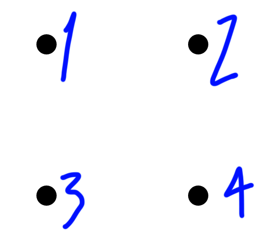
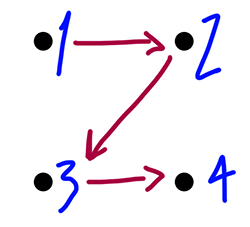
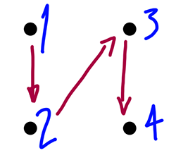
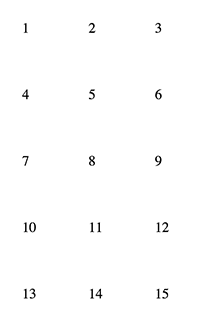
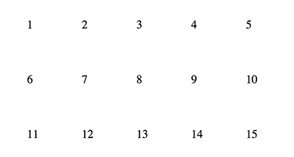
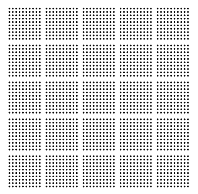

# d3-iconarray

A D3 plugin targeting V4 helping you to draw an array of icons.

<a href="#why">Why?</a>

There are two parts to this plugin. First a <a href="#layout">layout</a> which will assign x,y coordinates to elements of an array given some parameters. Second a <a href="#scale">scale</a> which will put regular breaks in the array of icons to aid legibility.

## Installing

If you use NPM, `npm install d3-iconarray`. Otherwise, download the [latest release](https://github.com/tomgp/d3-iconarray/releases/latest).

## API Reference

### Layout

<a href="#layout" name="layout">#</a> d3_iconarray<b>.layout</b>()

Construct a new icon array layout function.

<a href="#_layout" name="_layout">#</a> <b>layout</b>([data array])

The function created by the above.  When given an array of data will return an array containing grid positions as well as the original data. Unless a <a href="#height">height</a> or <a href="#width">width</a> restriction has been specified the layout will try to make the grid as square as possible. eg. a 100 element data array will result in a 10x10 grid.

example

```
var layout = d3_iconarray.layout();

var grid = layout([1,2,3,4]); 

/*
'grid' is

[
	{"data":1,"position":{"x":0,"y":0}},
	{"data":2,"position":{"x":1,"y":0}},
	{"data":3,"position":{"x":0,"y":1}},
	{"data":4,"position":{"x":1,"y":1}}
]

/*

```
You can use the resulting grid to plot icons, the data points will be arranged like this



TODO: block

<a href="#widthFirst" name="widthFirst">#</a> layout<b>.widthFirst</b>([boolean])

This function sets the order in which points are arranged in the grid. if widthFirst is set to true rows will be filled before starting the next, if it's false columns in the layout will be filled first. if no argument is provided it returns the current value.

example
```
var layout = d3_iconarray.layout()
					.widthFirst(true);

var grid = layout([1,2,3,4]); 
```

the resulting in the resulting grid the icons will be arranged like this



with ` .widthFirst(false)` they'll be arranged like this



<a href="#width" name="width">#</a> layout<b>.width</b>([integer])

the width function defines the maximum number of elements the grid will have in a given row. if no argument is provided it returns the current value.

example

```
var layout = d3_iconarray.layout().width(3);
var grid = layout([1,2,3,4,5,6,7,8,9,10,11,12,13,14,15]);
```
results in a grid like



TODO: block

<a href="#height" name="height">#</a> layout<b>.height</b>([integer])

the height function sets the maximum number of elements the grid will have in a given row. if no argument is provided it returns the current value.

example
```
var layout = d3_iconarray.layout().height(3);
var grid = layout([1,2,3,4,5,6,7,8,9,10,11,12,13,14,15]);
```

results in a grid like



<a href="#position" name="position">#</a> layout<b>.position</b>([integer])

given the a number representing an array element this function will tell you it's {x, y} location in the grid. 
This function needs some dimension of the grid (height or width) to have been set explicitly (by <a href="#height">height</a> or <a href="#width">width</a>) or implicitly by passing a data array to the layout function

example

```
var layout = d3_iconarray.layout();
var grid = layout([1,2,3,4,5,6,7,8,9,10,11,12,13,14,15]);

var p = layout.position(7);
// p is {x: 3, y: 1}

```

<a href="#maxDimension" name="maxDimension">#</a> layout<b>.maxDimension</b>([integer])

A bit like <a href="#position">position</a> but given a number will return the maximum extent of the lyout if it were to have that many elements. THis is useful for setting the domain of scales.

TODO: Block

### Scale

You can use any kind of scale to draw you grid to the screen. The scale provided by the plugin can let you add breaks to your icon array to improve legibility e.g. here's a 2500 element array grouped in to blocks of 100.



<a href="#scale" name="scale">#</a> d3_iconarray<b>.scale</b>()

<a href="#_scale" name="_scale">#</a> <b>scale</b>(x)

<a href="#domain" name="domain">#</a> scale<b>.domain</b>([numbers])

<a href="#range" name="range">#</a> scale<b>.range</b>([numbers])

<a href="#gapInterval" name="gapInterval">#</a> scale<b>.gapInterval</b>(x)

<a href="#gapSize" name="gapSize">#</a> scale<b>.gapSize</b>(x)

## Why?
<a href="#why" name="why">#</a> 
>Twenty years ago, a psychological study compared for the first time rudimentary icon displays for communicating risk. Today, we have dozens of randomized experiments to support the use of icon arrays (sometimes referred to as “pictographs”) as an evidence-based standard in medical risk communication.

[Why use Icon Arrays](http://www.iconarray.com/why)

>Icon arrays are particularly effective, and are apparently less likely to increase patient anxiety than other graphical techniques.

[Scientific American: Inadequate Data Visualization Leaves Patients Undereducated](http://blogs.scientificamerican.com/sa-visual/inadequate-data-visualization-leaves-patients-undereducated/)


